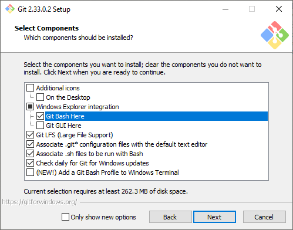

# Download from Git

The version manager app is very jank and not entirely dependable. This Git solution is a bit more involved, but uses much more dependable code. The files are still downloaded from my server, so there still may be network performance issues.

## First-time setup

### Install Git

If you don't have Git for Windows installed already, perform the following steps:

1. Download "64-bit Git for Windows Setup" from [this page](https://git-scm.com/download/win)
1. Run the installer
    * Ensure `Git LFS (Large File Support)` is checked
    * Check the `Git Bash Here` Windows Explorer integration to make later steps a bit easier
    
    * Leave the rest to the defaults, or change them if you know what you're doing

### Setup the repository

1. Disable the HD texture pack if you have it enabled
1. Open the Watch Dogs: Legion game details in Ubisoft Connect
1. *(Optional)* Properties -> Verify files
1. Properties -> Open folder
1. In the Explorer window that opens, right click the empty space and click `Git Bash Here`
1. In the terminal window that pops up, run the following commands:
    * `git init`
    * `git remote add origin https://gitea.charlielaabs.com/charlocharlie/wdl-patches.git`
    * `git fetch`
    * When a login box appears, enter the username and password found in the #resources channel of the Discord
    * `git checkout origin/master -- .gitignore .gitattributes`
    * `git add .`
    * Wait a while, length depends on your drive speed
    * `GIT_LFS_SKIP_SMUDGE=1 git checkout master --force`
    * `git lfs checkout`

## Switch versions

### Switch to an older version

To list the available versions, run:

* `git fetch`
* `git tag --list`

To switch to an older version:

1. Make sure Ubisoft Connect is open in online mode
1. Open and close Watch Dogs: Legion
1. Open Git Bash in the game folder and run:
  * `GIT_LFS_SKIP_SMUDGE=1 git checkout 1.2.40`
  * `git lfs checkout`
3. Open and close Watch Dogs: Legion again
4. Switch Ubisoft Connect to offline mode
5. You can now play the game as desired in offline mode

Do not change the DirectX version (11/12) of the game while on an old version.
If you do, you will have to revert to latest again and redo the above steps.

### Switch to the latest version

Open Git Bash in the game folder and run:

* `git fetch`
* `git checkout origin/master`

## Cleanup drive space

If you don't plan on switch versions for a while want to clear old versions from the cache, run the following in Git Bash from the game folder: `git lfs prune -c --recent`
